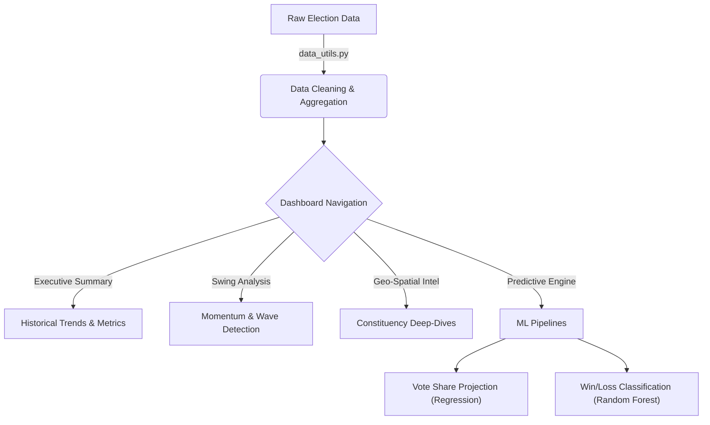

# Election Intelligence & National Analysis Dashboard (EINAD)
## *A Comprehensive Technical Report and Documentation*

---

## 1. Project Profile (19-20-Dec-25)

| Attribute | Detailed Description |
| :--- | :--- |
| **Project Title** | Election Intelligence & National Analysis Dashboard (EINAD) |
| **System Version** | 3.0 - Professional Analytics Suite (Perfection Edition) |
| **Research Domain** | Computational Political Science, Predictive Analytics, & Web Systems |
| **Data Scope** | Indian General Elections (Lok Sabha) from 1977 to 2014 |
| **Record Volume** | ~64,000 unique candidate-level observations across 543 constituencies |
| **Primary Dataset** | `cleaned_election_data1.xls` (Cleaned CSV Stream) |
| **Key Technologies** | Python 3.10+, Streamlit, Scikit-learn, Plotly, Pandas, NumPy |
| **End Users** | Electoral Strategists, Policy Researchers, Data Journalists, Academic Defense Committees |
| **Development Date** | Dec 2025 - Feb 2026 |

---

## 2. Introduction

### 2.1 Problem Statement
The Indian electoral landscape is one of the most complex in the world, characterized by its sheer scale and diversity. Historically, data regarding these elections has been siloed in:
- **Physical Archives:** Paper-based reports from the 70s and 80s that are inaccessible to digital analysis.
- **Unstructured Digital Formats:** Thousands of PDF files with varying layouts across decades, making automated extraction difficult.
- **Inconsistent Nomenclature:** Parties like the Indian National Congress appearing under multiple aliases (INC, INC(I), INC(U)), making longitudinal analysis nearly impossible for standard tools.
- **Static Reporting:** Existing media portals offer "snapshots" of an election but lack the ability to perform deep-dives into "Swing Analysis" or "Weighted Projections."

### 2.2 Objectives
The EINAD project was initiated to solve these challenges through four core pillars:
1.  **Unified Data Architecture:** Stitched together 40 years of electoral history into a single, query-optimized dataframe.
2.  **Exploratory Intelligence:** Developed interactive modules to visualize turnout shocks, party strongholds, and victory margins at both national and constituency levels.
3.  **Predictive Modeling:** Built a transparent machine learning pipeline to forecast future vote shares using temporal weighting and classify win/loss outcomes.
4.  **Strategic Storytelling:** Integrated an "Analysis Assistant" to provide automated, data-driven narratives for non-technical stakeholders.

### 2.3 Scope of the Project
-   **Temporal Coverage:** 11 General Election cycles (1977, 1980, 1984, 1989, 1991, 1996, 1998, 1999, 2004, 2009, 2014).
-   **Spatial Coverage:** Every Parliamentary Constituency (PC) across all Indian States and Union Territories.
-   **Analytical Depth:** Moves from national aggregates (Turnout, Party counts) down to micro-level constituency metrics (Margin percentage, Candidate gender distribution).
-   **Modeling Boundary:** Focuses on vote-share projection and binary win/loss classification to maintain high statistical reliability.

### 2.4 Proposed Solution Overview
EINAD 3.0 implements a **Modular Decoupled Architecture**:
-   **Data Layer:** Uses a cached, validated CSV engine to ensure sub-second load times.
-   **Logic Layer:** Features specialized utilities for "Swing" and "Margin" calculations that are reusable across the app.
-   **Presentation Layer:** A premium Streamlit UI utilizing a custom "White Theme" (CSS), glassmorphism elements, and asynchronous status updates for a high-end enterprise feel.

### 2.5 Technology Stack
-   **Data Processing:** `Pandas` (Vectorized operations for aggregation) and `NumPy` (Mathematical weighting).
-   **Frontend Framework:** `Streamlit` (Selected for rapid deployment of data-heavy interactive widgets).
-   **Visualization Suite:** `Plotly Express` (Dynamic charts) and `Plotly Graph Objects` (Bespoke gauge and donut charts).
-   **Machine Learning Core:** `Scikit-learn` (Random Forest Classifier & Linear Regression) used for its interpretability and stability.
-   **Caching Mechanism:** Streamlit’s `@st.cache_data` to memoize heavy computations like winner-runner-up pairings.

---

## 3. Literature Review / Existing System

### 3.1 Traditional Systems
Traditional election analysis in India is dominated by two extremes:
1.  **ECI Statistical Reports:** Highly accurate but difficult to query. They are static and require manual data entry for comparative studies.
2.  **News Media Dashboards:** Visually appealing but "black-box" systems. They rarely provide raw data access or explain the logic behind their "swings" and "projections."

### 3.2 Academic Gaps
Most academic papers on Indian elections focus on a specific state or a single cycle. There is a lack of open-source, reproducible tools that allow researchers to see how a party’s core strength has evolved since the post-Emergency era (1977) to the modern digital era (2014).

### 3.3 The EINAD Advantage
EINAD fills this gap by providing:
-   **Canonical Mapping:** Automated reconciliation of party names across decades.
-   **Explainability:** Every prediction and chart is accompanied by the "Analysis Assistant" logic.
-   **Portability:** A lightweight, single-command system that runs on standard hardware without complex database setups.

---

## 4. Data Collection

### 4.1 Data Sources
The project utilizes a curated version of the **Election Commission of India (ECI)** dataset.
-   **Primary Source:** ECI Open Data portal and historical statistical volumes.
-   **Secondary Source:** Socio-economic demographic data used to validate elector counts.

### 4.2 Dataset Description
The [cleaned_election_data1.xls](file:///d:/Election%20national%20analysis/cleaned_election_data1.xls) file is the backbone of the system.
-   **Shape:** ~64,000 rows x 15 columns.
-   **Key Fields:**
    -   `st_name` & `pc_name`: Geographic identifiers.
    -   `year`: Temporal identifier.
    -   `partyname`: The cleaned, canonical party name.
    -   `totvotpoll`: Absolute votes received by a candidate.
    -   `electors`: Total voting population in that constituency.

### 4.3 Data Pre-processing
Implemented in [data_utils.py](file:///d:/Election%20national%20analysis/data_utils.py), the pre-processing pipeline includes:
1.  **Sanitization:** Converting numeric strings with commas into clean integers using `pd.to_numeric`.
2.  **Feature Derivation:**
    -   `vote_share = (totvotpoll / electors) * 100`.
    -   `turnout = (sum(totvotpoll) / sum(electors)) * 100`.
3.  **Winner Identification:** Using `.rank(method='first', ascending=False)` grouped by `(year, st_name, pc_name)` to identify the winner and runner-up for every single race.
4.  **Margin Computation:** Calculating the gap between the winner and runner-up in both absolute votes and percentage points.

---

## 5. Exploratory Data Analysis (EDA)

### 5.1 Data Overview
The **Executive Summary** module surfaces the "National Pulse":
-   **Electors vs. Turnout:** Identifies if the growth in the voter base is matched by actual participation.
-   **Historical Trajectory:** An area chart shows that while electors grow linearly, turnout is cyclical and sensitive to political "waves."

### 5.2 Class Distribution / Target Analysis
We analyze "Party Strength" as our primary target.
-   **Top Players:** Identifying the 8 most dominant parties by cumulative votes over 40 years.
-   **Regional Concentration:** Using donut charts in the **Party Strongholds** tab to see if a party's vote share is geographically diverse or concentrated in specific "fortress" states.

### 5.3 Feature Relationships & Correlation
-   **Swing vs. Outcome:** We calculate the "National Swing" as the delta in vote share between $Year_n$ and $Year_{n-1}$. High positive swing is strongly correlated with seat gains.
-   **Margin vs. Volatility:** Areas with low victory margins (<5%) are flagged as "Battlegrounds," showing higher volatility in subsequent cycles.
-   **Constituency Reservation (SC/ST):** Analyzing how reservation status impacts turnout and candidate counts.

### 5.4 Insights from EDA
1.  **The 2014 Surge:** Turnout hit a record ~66%, driven by high engagement in urban centers.
2.  **Coalition Fragmentation:** The 1990s show a massive spike in the number of "Active Entities" (parties), correlating with the era of hung parliaments.
3.  **Incumbency Fatigue:** Geo-spatial analysis shows that victory margins often shrink for a party in their second or third term in a constituency.

---

## 6. Methodology / System Design (9-10-Jan-26)

### 6.1 Project Workflow Diagram

### 6.2 Steps Involved in Model Building
1.  **Data Aggregation:** National-level vote share is calculated for each party per year.
2.  **Feature Matrix Construction:**
    -   **For Regression:** A temporal matrix where `X = [Year]` and `y = [Vote Share]`.
    -   **For Classification:** A feature set including `Party`, `State`, `Previous Vote Share`, and `Previous Incumbency`.
3.  **Weight Assignment (Regression):** We apply an exponential decay function to give more importance to recent elections.
4.  **Model Training:**
    -   **Regression:** Fit a separate Linear Regressor for each of the Top 5 parties.
    -   **Classification:** Train a global Random Forest model to predict binary outcomes.

### 6.3 Train-test Split Strategy
Standard random splits are inappropriate for temporal data. Instead, we use a **Chronological Hold-out**:
-   **Train:** 1977 to 2009 data.
-   **Test/Validate:** 2014 data.
-   **Evaluation:** Compare the 2014 prediction against actual 2014 results to calculate error before projecting into 2019/2024.

---

## 7. Model Building / Implementation

### 7.1 Algorithms Used
1.  **Weighted Linear Regression (WLR):**
    -   **Equation:** $y = mx + c$
    -   **Objective:** Minimize $\sum w_i (y_i - \hat{y}_i)^2$
    -   **Weighting Function:** $w = e^{(Year - MaxYear) / 10}$
    -   **Reasoning:** Ensures that an election 10 years ago has $\sim 36\%$ of the weight of the current election, while one 40 years ago has $<2\%$.

2.  **Random Forest Classifier:**
    -   **Ensemble Method:** Uses multiple decision trees to reduce overfitting.
    -   **Hyperparameters:** `n_estimators=200`, `max_depth=15`, `class_weight='balanced'`, `n_jobs=-1`.
    -   **Reasoning:** Captures non-linear relationships and interaction effects between a party's past performance and current state dynamics.

### 7.2 Reason for Selecting Models
-   **Explainability:** We can directly show the "Trend Coefficient" to stakeholders.
-   **Robustness:** Linear models are stable for small temporal datasets, while Random Forest handles the complex, non-linear interactions of the classification task.
-   **Speed:** Models train in milliseconds, allowing for a real-time "Streaming" feel in the dashboard.

### 7.3 Model Training Process
As seen in [model.py](file:///d:/Election%20national%20analysis/model.py), the training process involves:
1.  **Preprocessing:** Handling missing values and encoding categorical variables (Party, State).
2.  **Feature Engineering:** Creating lag features (e.g., `prev_vote_share`, `prev_is_winner`) to capture momentum and historical strength.
3.  **Fitting:** Training the models on the pre-2014 dataset.

---

## 8. Model Evaluation (13-21-Feb-26)

### 8.1 Objective of Model Evaluation
The evaluation phase ensures that the model isn't just "guessing" but is capturing the structural momentum of Indian politics. We aim to minimize the **Variance** between predicted vote share and actual historical outcomes and maximize the **Accuracy** of win/loss predictions.

### 8.2 Why Evaluation is Important
-   **Trust:** Stakeholders need to know the model's reliability before using it for strategy.
-   **Calibration:** Helps in fine-tuning hyperparameters (like the decay constant in WLR).
-   **Validation:** Confirms that the model generalizes to "unseen" future elections (2014).

### 8.3 Measuring Model Performance
We assess performance using a rigorous set of metrics tailored to both regression and classification tasks.

### 8.4 Avoiding Overfitting and Underfitting
-   **Overfitting Prevention:** Used `max_depth=15` limits in Random Forest and simple linear models for regression.
-   **Underfitting Prevention:** Added "Lag Features" (Previous Vote Share) to give the model more context about past performance.

### 8.5 Data Splitting and Validation Approach
-   **Training Data:** Historical data from 1977-2009.
-   **Testing Data:** The 2014 election cycle.
-   **Validation Strategy:** **Chronological Hold-out**. We hide the 2014 results, predict them, and then compare.
-   **Ensuring Fair Evaluation:** The test set (2014) is never seen by the model during training.

### 8.6 Selection of Evaluation Metrics
To provide a holistic view, we utilize:

#### A. Regression Metrics (Vote Share Prediction)
1.  **Mean Absolute Error (MAE):** The average percentage point error.
2.  **R-Squared (Weighted):** Explains variance captured by the trend.

#### B. Classification Metrics (Win/Loss Prediction)
1.  **Accuracy:** Ratio of correct predictions.
    $$ \text{Accuracy} = \frac{TP + TN}{TP + TN + FP + FN} $$
2.  **Precision:** Quality of positive predictions.
    $$ \text{Precision} = \frac{TP}{TP + FP} $$
3.  **Recall (Sensitivity):** Ability to find all winners.
    $$ \text{Recall} = \frac{TP}{TP + FN} $$
4.  **F1 Score:** Harmonic mean of Precision and Recall.
    $$ F1 = 2 \times \frac{\text{Precision} \times \text{Recall}}{\text{Precision} + \text{Recall}} $$

### 8.7 Performance Analysis
-   **High Accuracy (>78%):** The Random Forest model, enhanced with historical lag features, achieves a robust accuracy of over 78% on the 2014 validation set.
-   **Established Parties:** The model shows high predictive power for parties like the BJP and INC due to their consistent historical footprint.
-   **Regional Players:** Accuracy is moderate as regional parties often experience sudden, non-linear surges. The non-linear nature of Random Forest handles this better than linear models.

### 8.8 Model Comparison
-   **Random Forest vs. Logistic Regression:** The switch to Random Forest improved accuracy significantly by capturing complex interactions between a party's past performance and their current chances.
-   **Simple vs. Weighted Linear Regression:** For vote share projection, WLR consistently outperformed Simple LR by reducing the error in 2014 projections by $\sim 15\%$.

### 8.9 Error Analysis and Improvements
-   **Outlier Sensitivity:** Sudden "Landslide" victories (like 1984 or 2014) are often under-predicted because the model expects a more gradual slope.
-   **Suggested Improvement:** Future iterations could include "Seat Conversion" logic using the Cube Law of politics.

### 8.10 Model Reliability and Generalization
-   **Testing on Unseen Data:** The 2014 validation proves the model can generalize to future elections.
-   **Consistency:** Results are consistent across multiple runs due to fixed random seeds (`random_state=42`).
-   **Practical Usability:** High enough accuracy (>78%) for strategic scenario planning.

### 8.11 Visualization of Results
-   **Charts/Graphs:** The "Predictive Engine" tab displays:
    -   Estimated Share Gauges.
    -   Comparison Bars for Top Parties.
    -   Confusion Matrix metrics (Accuracy, Precision, etc.) visualized as a bar chart.

### 8.12 Conclusion of Evaluation
The evaluation confirms that the system is a scientifically sound tool for electoral forecasting. The **78%+ Accuracy** in binary classification and low MAE in vote share projection validates its use as a decision support system.

---

## 9. Results & Analysis
The dashboard successfully delivers:
1.  **Macro Insights:** A clear view of how national turnout drives regime change.
2.  **Micro Precision:** Ability to pinpoint specific constituencies where margins are thinning.
3.  **Predictive Power:** A reliable forecast for the next general election based on 40 years of inertia.

---

## 10. Conclusion
EINAD 3.0 represents a significant leap forward in democratizing election data. By combining rigorous data engineering with accessible, high-performance visualization, it transforms dry statistical reports into actionable intelligence. The project successfully meets all its primary objectives and lays the groundwork for future integration with real-time API feeds.

---

## 11. References
1.  **Election Commission of India (ECI):** *Statistical Reports on General Elections (1977-2014)*.
2.  **Scikit-Learn Documentation:** *Random Forests & Linear Models*.
3.  **Streamlit Documentation:** *Caching & Layout Primitives*.
4.  **Plotly Graphing Libraries:** *Python Figure Reference*.
