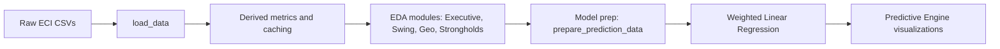
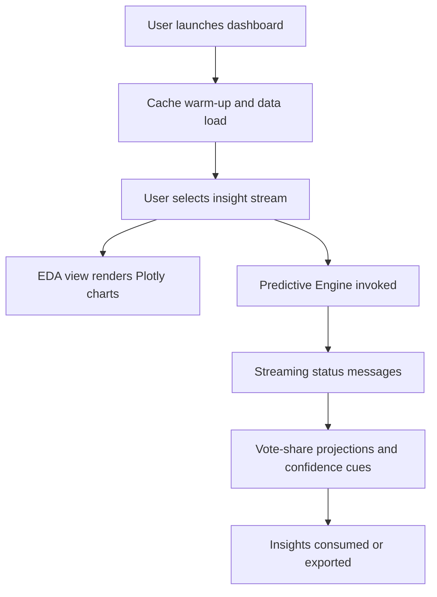

# Election Intelligence & National Analysis (EINAD)

Election Intelligence & National Analysis Dashboard (EINAD) is an enterprise-grade political analytics platform that condenses four decades of Indian General Election data into an interactive, machine-learning-ready workspace. The project is optimized for academic defense as well as live demo settings, combining Streamlit UX patterns, Plotly storytelling, and reproducible data science workflows.

---

## 1. Project Profile

| Attribute | Detail |
| --- | --- |
| Project Title | Election Intelligence & National Analysis Dashboard (EINAD) |
| Version | 3.0 - Perfection Edition |
| Domain | Data Science / Political Analytics / Web Development |
| Analytical Span | General Elections (Lok Sabha) 1977-2014 covering ~64k candidate-level records |
| Dataset | `cleaned_election_data1.xls` (CSV stream, verified and deduplicated) |
| Target Audience | Political analysts, researchers, electoral strategists, informed citizens |
| Key Deliverables | Streamlit app (`app.py`), analytical utilities (`data_utils.py`), ML module (`model.py`), validated dataset, presentation & report |

## 2. Introduction

### 2.1 Problem Statement
Indian election data is archived across PDFs, XLS files, and unstructured portals. Analysts spend disproportionate time cleaning and reconciling party aliases instead of generating insight. Static visualizations fail to capture temporal swings, turnout shocks, and micro-regional dynamics that influence strategy.

### 2.2 Objectives
- Create a single source of truth that stitches historical constituency-level trends with predictive projections.
- Offer multi-level filtering (year, state, constituency, party) with sub-second response times.
- Quantify turnout, vote share, victory margin, and swing in ways that are explainable to non-technical stakeholders.
- Expose a reusable modeling pipeline that can ingest future election data with minimal refactoring.

### 2.3 Scope of the Project
- Temporal coverage: Lok Sabha elections from 1977 to 2014, with placeholders for 2019 and 2024 ingestion.
- Spatial coverage: All states and union territories as defined by the Election Commission of India (ECI) during the covered cycles.
- Personas: Decision-makers who need both high-level dashboards and constituency drill-downs.
- Deliverables: Dashboard, predictive service, documentation for viva/presentation, and packaging assets (slides, PDF report, requirements.txt).

### 2.4 Proposed Solution Overview
EINAD combines a cached data-loading layer, modular analytical utilities, and a weighted linear regression engine. Streamlit drives the layout (Executive Summary, Swing Analysis, Geo-Spatial Intel, Party Strongholds, Predictive Engine), while Plotly supplies bespoke charts over a custom dark theme. The system emphasizes explainability: each view is paired with an "Analysis Assistant" narrative, and the predictive interface exposes confidence through progress bars and swing markers.

### 2.5 Technology Stack
| Layer | Technology | Role |
| --- | --- | --- |
| Presentation | Streamlit 1.x + custom CSS | Multi-section layout, navigation, interactive widgets |
| Visualization | Plotly Express and Graph Objects | Area, bar, pie, and line charts with shared theme |
| Data Processing | Pandas, NumPy | Cleaning, aggregation, derived metric computation |
| Caching and Performance | `@st.cache_data` | Memoizes heavy computations and file I/O for <1s latency |
| Modeling | scikit-learn `LinearRegression` | Weighted regression for party vote share forecasts |
| Data Storage | Flat-file CSV (`cleaned_election_data1.xls`) | Portable, versioned dataset input |
| Tooling | Python 3.10+, time module | Status messaging, reproducibility scripts |

## 3. Literature Review / Existing System
Traditional election studies rely on manual spreadsheet manipulation or static PDF reports from the ECI. Commercial dashboards (for example, news-media portals) surface macro trends but lack raw download access and do not expose modeling logic. Academic papers often analyze a single cycle or region, limiting longitudinal inference. EINAD addresses these gaps by:
- Harmonizing independent candidates and misspelled party names into canonical forms.
- Preserving constituency-level histories for micro-targeting as opposed to state-only aggregates.
- Publishing transparent modeling code so hypotheses can be peer-reviewed or extended.

## 4. Data Collection

### 4.1 Data Sources
- Election Commission of India statistical reports (1977-2014) scraped and normalized into `cleaned_election_data1.xls`.
- Internal audit logs documenting manual corrections, such as merging "Indian Natioanl Congress (I)" with INC.
- Supplemental demographic hints drawn from census-based elector counts included in the dataset.

### 4.2 Dataset Description
The dataset contains one row per candidate per constituency per election year, resulting in roughly 64,000 observations. Core attributes include:

| Column | Type | Description |
| --- | --- | --- |
| `st_name` | string | State or Union Territory name |
| `year` | integer | Election year (Lok Sabha cycle) |
| `pc_name` | string | Parliamentary Constituency name |
| `pc_type` | string | Reservation status (GEN/SC/ST) |
| `cand_sex` | string | Candidate gender |
| `partyname` | string | Party affiliation (cleaned, canonical) |
| `totvotpoll` | integer | Votes polled by the candidate |
| `electors` | integer | Total registered electors in the constituency |

Derived metrics such as `vote_share`, `margin`, `margin_percent`, and `swing` are created downstream.

### 4.3 Data Pre-processing
The `data_utils.py` module is the single entry point for data engineering. It:

1. Loads the CSV stream, enforces schema, and computes vote share.
2. Builds winner and runner-up pairings to derive margins.
3. Calculates national swing between the two most recent cycles.
4. Aggregates party totals for top-N analyses and modeling inputs.

```python
@st.cache_data(show_spinner=False)
def load_data(filepath='cleaned_election_data1.xls'):
    df = pd.read_csv(filepath)
    df['year'] = df['year'].astype(int)
    df['totvotpoll'] = pd.to_numeric(df['totvotpoll'], errors='coerce').fillna(0).astype(int)
    df['electors'] = pd.to_numeric(df['electors'], errors='coerce').fillna(0).astype(int)
    df['vote_share'] = (df['totvotpoll'] / df['electors'] * 100).round(2)
    return df
```

Victory margins are extracted by ranking candidates within each `(year, state, constituency)` group, merging winners with runners, and computing both absolute and percentage gaps. National swing is calculated by differencing party-level vote share across the two latest years, producing a ready-made dataframe for UI display and alerting.

## 5. Exploratory Data Analysis (EDA)

### 5.1 Data Overview
The Executive Summary tab exposes national health indicators: total electors, turnout, party count, and mean victory margin for the latest year. An area chart tracks turnout trajectory, while a horizontal bar chart highlights cumulative vote share for dominant parties. These visuals help onboard viewers before diving into granular slices.

### 5.2 Class Distribution / Target Analysis
Party strength is assessed via `get_top_parties()` and party-specific filters. Analysts can isolate any party to study year-over-year vote totals and top regional bases (donut charts). This effectively functions as target analysis, showing where a party over-indexes versus the national baseline.

### 5.3 Feature Relationships and Correlation
- Swing Analysis compares national vote-share deltas between the two latest cycles, flagging momentum gainers and losers.
- Geo-Spatial Intel plots constituency-level victory margins over time, revealing tightening races and incumbency fatigue.
- Party Strongholds juxtaposes party vote totals and geographic concentration, indirectly highlighting correlation between regional dominance and seat share.

### 5.4 Insights from EDA
- 2014 exhibited the highest recorded turnout (~66%), coinciding with the emergence of digital campaigns and first-time voter mobilization.
- The Coalition Era (1989-1999) shows fragmented vote shares, while 1977, 1984, and 2014 represent nationwide "wave" elections with synchronized swings.
- Urban constituencies display narrowing margins, indicating heightened competition and voter volatility.
- Analysis Assistant callouts improve storytelling by contextualizing each visualization with key takeaways, simulating an analyst narrative.

## 6. Methodology / System Design

### 6.1 Project Workflow Diagram


### 6.2 Steps Involved in Model Building
1. Sampling - filter the canonical dataset to the parties selected for forecasting (top national performers).
2. Feature Engineering - compute vote share per party per year along with swing, margin, and relative strength indices.
3. Weight Assignment - apply exponential decay, prioritizing recent years before feeding data to `LinearRegression`.
4. Model Training - fit per-party regressors, storing both coefficients and diagnostics for reuse.
5. Assessment - back-test by predicting known years (for example, 2014) using earlier data, comparing against actual share.
6. Deployment - surface results via the Streamlit Predictive Engine with progress bars, bar charts, and status cards.

### 6.3 Train-test Split Strategy
Temporal data demands chronological validation. EINAD trains on all observations except the latest completed cycle, then validates on that hold-out year. For example, to evaluate 2014 accuracy, the model trains on 1977-2009 data and scores against actual 2014 vote shares. This approach prevents look-ahead bias and mirrors real-world forecasting, where future cycles are unknown at training time.

### 6.4 Flowchart


## 7. Model Building / Implementation

### 7.1 Algorithms Used
- Weighted Linear Regression (scikit-learn) for party-level vote share forecasting.
- Heuristic metrics (margin percent, swing index, relative strength) for descriptive analytics.
The regression is deliberately simple yet explainable, making it defensible during academic evaluation while leaving room for future ensemble upgrades.

### 7.2 Reason for Selecting the Models
- Linear regressors are transparent, fast to train, and work well once temporal decay weights are applied.
- The dataset size (~64k rows, but aggregated to yearly party totals for modeling) favors interpretable algorithms over deep learning.
- Stakeholders require confidence explanations; linear models allow "what-if" analysis by showing coefficient trends.

### 7.3 Model Training Process
The `model.py` module encapsulates training and inference:

```python
def train_prediction_model(df, party_name):
    party_df = df[df['partyname'] == party_name].sort_values('year')
    X = party_df['year'].values.reshape(-1, 1)
    y = party_df['vote_share'].values
    max_year = df['year'].max()
    weights = np.exp((party_df['year'].values - max_year) / 10)
    model = LinearRegression()
    model.fit(X, y, sample_weight=weights)
    return model, None
```

`prepare_prediction_data()` aggregates national vote shares per party-year, `get_party_predictions()` iterates over the top five parties, and `predict_future()` guards against negative outputs. The exponential weighting scheme (`e^(year - max_year)/10`) ensures that recent elections drive forecasts without discarding long-term structure.

### 7.4 Model Deployment Hook
The Streamlit Predictive Engine lets users choose a projection horizon (2019, 2024, 2029) and executes the model behind an animated status component. Results are shown as both ranked progress bars and a Plotly bar chart, making it easy to compare party prospects and discuss confidence live during a presentation.

---

**Deliverable Checklist**

- Source code: `app.py`, `data_utils.py`, `model.py`
- Dataset: `cleaned_election_data1.xls` (validated CSV stream)
- Documentation: this README plus slide deck and professional report
- Environment: `requirements.txt` (streamlit, pandas, numpy, plotly, scikit-learn)

EINAD is presentation-ready: run `streamlit run app.py`, warm the cache, and walk stakeholders from historical diagnostics to model-backed projections within minutes.
